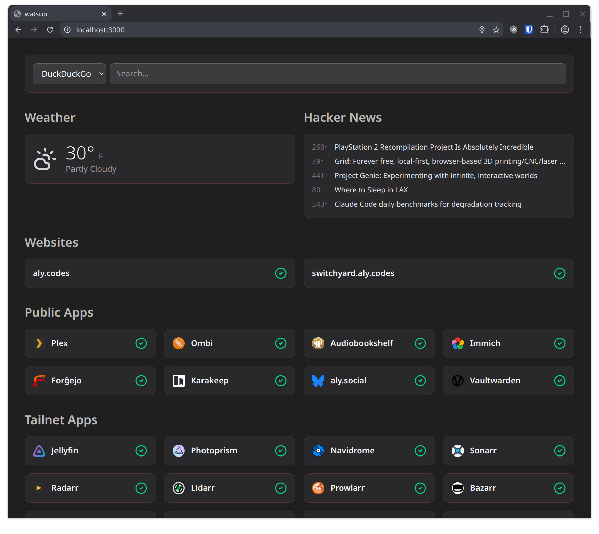

# watsup



watsup is a convenient little dashboard and app launcher for [cute.haus](https://github.com/alyraffauf/cute.haus), my hybrid homelab/cloud infrastructure. Very much inspired by [glance](https://github.com/glanceapp/glance), but I grew tired of the limitations of a generic solution. Plus, I wanted to build my own for fun.

In addition to some pleasantries (top 5 stories on Hacker News, weather, search), it shows every website and service I host, with a checkmark reflecting whether they're reachable or not.

## build stuff

To install dependencies:

```bash
bun install
```

To start a development server:

```bash
bun dev
```

To run for production:

```bash
bun start
```

This project was created using `bun init` in bun v1.3.7. [Bun](https://bun.com) is a fast all-in-one JavaScript runtime.
